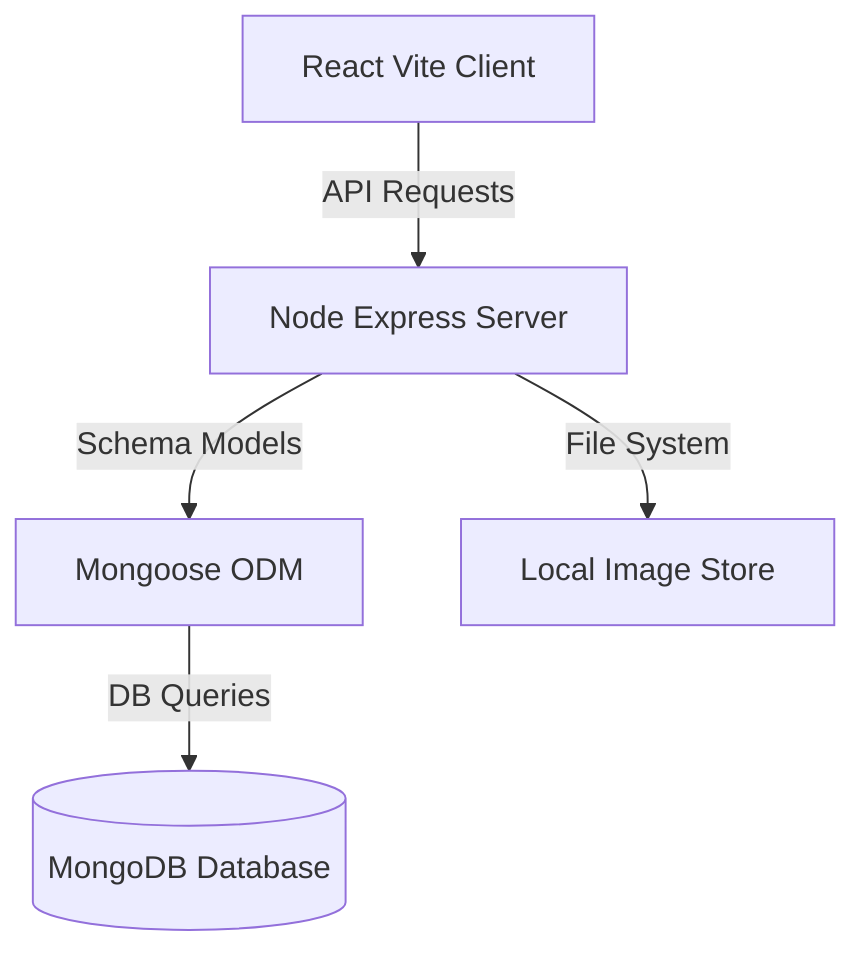

# SHIELD: Police Theft Management & Suspect Match System

SHIELD is a modern, high-fidelity full-stack theft management and suspect matching platform designed for municipal police departments. It integrates geospatial distance calculations, physical characteristics scanning, QR-based property labels, and live webcam scans for automated property recovery.

---

## 👮 System Architecture



### Core Workflows

1. **Intake & QR Labeling**: Filer registers a complaint along with a list of stolen property. The system dynamically issues unique QR identification tokens and saves items.
2. **Automated Matching Engine**: When a complaint or suspect profile is registered, the matching engine runs background scores comparing operating area proximities (Haversine formula), crime categories, and descriptive tags (scars, tattoos, features). Match records above 40% are saved as alerts.
3. **Verification**: Officers review suspect alert feeds, submit manual verification notes, or dismiss alarms.
4. **QR Recovery Scanner**: Officers use a webcam or upload item snapshots to scan barcodes, instantly querying the inventory to mark property as recovered. Mongoose schema triggers automatically resolve parent complaints when all child items are retrieved.

---

## 📂 Project Organization

```text
Police-Theft-Management-System/
├── client/                     # React Frontend (Vite)
│   ├── public/                 # Static assets
│   ├── src/
│   │   ├── components/         # Common UI Cards, sidebars, headers
│   │   ├── pages/              # Screens (Dashboard, Suspects, Complaints, QR scanner)
│   │   ├── context/            # Session State (AuthContext)
│   │   ├── services/           # Axios REST clients
│   │   └── utils/              # QR extraction, risk level classifiers, date formats
│   ├── index.html
│   ├── package.json
│   └── vite.config.js
├── server/                     # Express Backend API
│   ├── config/                 # DB connections & Multer uploads config
│   ├── controllers/            # Auth, Criminal, Complaint, QR, Match actions
│   ├── middleware/             # Protected JWT authorization & role validation
│   ├── models/                 # Mongoose schemas (User, Criminal, StolenItem, Matches)
│   ├── routes/                 # REST endpoints
│   ├── services/               # QR builders & suspect matching triggers
│   ├── uploads/                # Suspect photo store directory
│   ├── utils/                  # Haversine distance, matching calculators, API outputs
│   ├── app.js
│   ├── server.js
│   ├── package.json
│   └── .env
├── database/                   # Schema Documentation & Seeding Tools
│   ├── schema.sql              # MongoDB documents schema blueprint
│   ├── seed.js                 # Database seeder execution script
│   ├── seed.sql                # Static record seed details
│   └── triggers.js             # Mongoose middleware equivalent hook blueprints
├── docker-compose.yml          # Container configuration for MongoDB
└── README.md
```

---

## 🚀 Execution Instructions

### Prerequisites
- Node.js (v18+)
- Docker (optional, to run MongoDB instantly)

---

### Step 1: Start MongoDB
If using Docker, start MongoDB and Mongo Express in the project root:
```bash
docker-compose up -d
```
*Database will listen on `localhost:27017`.*
*Mongo Express Dashboard will load on `localhost:8081`.*

---

### Step 2: Initialize & Seed Backend
1. Navigate to the `server` directory and install dependencies:
   ```bash
   cd server
   npm install
   ```
2. Seed the database with default profiles (Admin, Officers, Citizens, Suspects):
   ```bash
   npm run seed
   ```
3. Start the API server in development mode:
   ```bash
   npm run dev
   ```
*API Server will listen on `http://localhost:5000`.*

---

### Step 3: Initialize & Start Client
1. Navigate to the `client` directory and install dependencies:
   ```bash
   cd ../client
   npm install
   ```
2. Start the Vite React development server:
   ```bash
   npm run dev
   ```
*Client Interface will load on `http://localhost:3000`.*

---

## 🔐 Default Demo Accounts

Prefilled credentials are provided inside the **Demo Credentials Drawer** on the login screen for testing convenience:

* **Officer Account**:
  - Email: `officer1@police.gov`
  - Password: `password123`
* **Citizen Account**:
  - Email: `john.doe@gmail.com`
  - Password: `password123`
